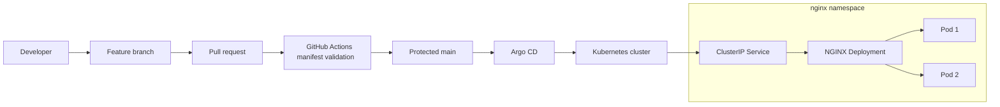

# Platform Engineering GitOps with Argo CD

[](https://github.com/AZ1600/platform-engineering-gitops-argocd/actions/workflows/validate-manifests.yaml)

## Overview

This project demonstrates a secure GitOps continuous-delivery workflow using Argo CD, Kubernetes and GitHub Actions.

Kubernetes resources are defined declaratively in Git. Changes are introduced through protected pull requests, validated in CI and merged into the `main` branch. Argo CD continuously compares the desired state in Git with the Kubernetes cluster and automatically reconciles differences.

The project is currently demonstrated on a local Docker Desktop Kubernetes cluster. The manifests and GitOps workflow can also be adapted for managed Kubernetes platforms such as Amazon EKS.

## Architecture



## GitOps Workflow

1. A developer creates a feature branch.
2. Kubernetes or Argo CD configuration is changed.
3. A pull request is opened against `main`.
4. GitHub Actions checks YAML quality and Kubernetes schemas.
5. The protected branch permits the change to be merged after the required check passes.
6. Argo CD detects the new commit on `main`.
7. Argo CD synchronizes the desired state into Kubernetes.
8. Kubernetes performs the rollout and reports resource health.
9. Argo CD reports the application as `Healthy` and `Synced`.

## Technologies

- Kubernetes
- Argo CD
- Docker Desktop
- GitHub
- GitHub Actions
- GitHub branch protection
- NGINX
- Yamllint
- Kubeconform
- GitOps

## Repository Structure

```text
platform-engineering-gitops-argocd/
├── .github/
│   └── workflows/
│       └── validate-manifests.yaml
├── argocd/
│   ├── application.yaml
│   └── project.yaml
├── docs/
│   └── screenshots/
│       ├── argocd-resource-tree.png
│       ├── kubectl-resources.png
│       ├── nginx-application.png
│       └── protected-pr-validation.png
├── manifests/
│   ├── deployment.yaml
│   └── service.yaml
└── README.md
```

## Components

### Argo CD Application

`argocd/application.yaml` defines the application managed by Argo CD.

It includes:

- Automated synchronization
- Automatic pruning
- Self-healing
- Namespace creation
- Retry behaviour
- Deployment from the `main` branch
- Kubernetes manifests loaded from `manifests/`

### Argo CD Project

`argocd/project.yaml` defines the project boundary for the application.

It restricts:

- The permitted Git repository
- The permitted deployment destination
- The permitted Kubernetes resource types

### Kubernetes Deployment

`manifests/deployment.yaml` manages the NGINX replicas, rollout behaviour, health probes and container security configuration.

The container:

- Runs as non-root UID and GID `101`
- Uses the official unprivileged NGINX image
- Uses a container image pinned by digest
- Uses a read-only root filesystem
- Prevents privilege escalation
- Drops all Linux capabilities
- Uses the `RuntimeDefault` seccomp profile
- Does not automatically mount a service-account token
- Uses memory-backed temporary storage
- Exposes container port `8080`

### Kubernetes Service

`manifests/service.yaml` provides stable internal access to the NGINX Pods.

The Service selects the NGINX Pods and forwards traffic to the named HTTP container port.

## Security Controls

This project applies several workload and software-supply-chain controls:

- Non-root container execution
- Explicit UID and GID
- Read-only container filesystem
- Privilege escalation disabled
- All Linux capabilities removed
- Runtime-default seccomp profile
- Service-account token automount disabled
- Container image pinned by digest
- GitHub Actions dependencies pinned
- Minimal workflow permissions
- Protected `main` branch
- Required CI status check
- Pull-request-based changes

These controls reduce the permissions available to a compromised container and improve the reproducibility of deployments.

## Continuous Integration

The GitHub Actions workflow validates repository changes before they are merged.

### YAML linting

Yamllint checks:

- YAML syntax
- Formatting and indentation
- Duplicate keys
- Trailing whitespace
- Missing final newlines
- Common YAML quality problems

### Kubernetes schema validation

Kubeconform performs strict schema validation of the standard Kubernetes resources in `manifests/`.

The workflow uses:

- Minimal read-only GitHub permissions
- Pinned action and container dependencies
- A job timeout
- Concurrency cancellation
- A required status check on the protected `main` branch

Passing CI confirms that the files satisfy the configured YAML and Kubernetes schema rules. Runtime behaviour is verified separately in the Kubernetes cluster.

## Prerequisites

Install:

- Docker Desktop with Kubernetes enabled
- `kubectl`
- Git
- Argo CD CLI (optional but recommended)

Confirm access to the cluster:

```bash
kubectl config current-context
kubectl cluster-info
```

For the local demonstration, the expected context is:

```text
docker-desktop
```

## Install Argo CD Locally

Create the Argo CD namespace:

```bash
kubectl create namespace argocd
```

Install Argo CD:

```bash
kubectl apply \
  --namespace argocd \
  --filename https://raw.githubusercontent.com/argoproj/argo-cd/stable/manifests/install.yaml
```

Wait for the Argo CD workloads:

```bash
kubectl wait \
  --namespace argocd \
  --for=condition=Available \
  deployment \
  --all \
  --timeout=300s
```

Confirm that the Pods are running:

```bash
kubectl get pods --namespace argocd
```

## Open the Argo CD Interface

Forward a local port to the Argo CD server:

```bash
kubectl port-forward \
  --namespace argocd \
  service/argocd-server \
  8082:443
```

Open:

```text
https://localhost:8082
```

The browser may display a warning because the local Argo CD server uses a self-signed certificate.

Retrieve the initial administrator password:

```bash
kubectl get secret argocd-initial-admin-secret \
  --namespace argocd \
  --output jsonpath='{.data.password}' |
  base64 --decode

echo
```

Sign in with the username `admin`.

## Bootstrap the GitOps Application

Apply the Argo CD project first:

```bash
kubectl apply --filename argocd/project.yaml
```

Apply the application:

```bash
kubectl apply --filename argocd/application.yaml
```

Argo CD will create the `nginx` namespace and synchronize the manifests automatically.

## Verify the Deployment

Check the Argo CD application:

```bash
kubectl get application nginx --namespace argocd
```

Expected status:

```text
NAME    SYNC STATUS   HEALTH STATUS
nginx   Synced        Healthy
```

Check the Kubernetes resources:

```bash
kubectl get all --namespace nginx
```

Verify the Deployment rollout:

```bash
kubectl rollout status \
  deployment/nginx \
  --namespace nginx
```

Check the running Pods:

```bash
kubectl get pods --namespace nginx
```

## Verify Non-Root Execution

Select one of the NGINX Pods:

```bash
POD_NAME=$(kubectl get pods \
  --namespace nginx \
  --selector app=nginx \
  --output jsonpath='{.items[0].metadata.name}')
```

Check the user running inside the container:

```bash
kubectl exec \
  --namespace nginx \
  "$POD_NAME" \
  -- id
```

The output should show UID and GID `101`.

Confirm that service-account token automount is disabled:

```bash
kubectl get deployment nginx \
  --namespace nginx \
  --output jsonpath='{.spec.template.spec.automountServiceAccountToken}{"\n"}'
```

Expected output:

```text
false
```

## Access the Application

Forward a local port to the Kubernetes Service:

```bash
kubectl port-forward \
  --namespace nginx \
  service/nginx-service \
  8080:80
```

Open:

```text
http://localhost:8080
```

Keep the port-forward process running while accessing the application.

If port `8080` is already in use, use another local port:

```bash
kubectl port-forward \
  --namespace nginx \
  service/nginx-service \
  8081:80
```

Then open:

```text
http://localhost:8081
```

## Project Evidence

### Argo CD Resource Tree

Argo CD continuously reconciles the Git repository with the Kubernetes cluster. The application is synchronized and healthy, and its Deployment and Service match the desired state stored in Git.


### Protected Pull Request Validation

Changes are merged through pull requests after the required YAML and Kubernetes schema validation succeeds.

This example documents the migration of NGINX to a non-root container with a read-only filesystem, dropped Linux capabilities and a digest-pinned image.


### Deployed NGINX Application

The deployed application is accessible through the Kubernetes Service using local port forwarding.


### Kubernetes Resources

The Deployment, Service and Pods can also be inspected directly using `kubectl`.


## Troubleshooting

### Argo CD namespace not found

Verify that Argo CD is installed:

```bash
kubectl get namespace argocd
kubectl get pods --namespace argocd
```

If the namespace does not exist, install Argo CD before applying the `Application` and `AppProject` resources.

### Application remains OutOfSync

Request a hard refresh:

```bash
kubectl annotate application nginx \
  --namespace argocd \
  argocd.argoproj.io/refresh=hard \
  --overwrite
```

Check the application again:

```bash
kubectl get application nginx --namespace argocd
```

### Application reports Missing

Inspect its conditions:

```bash
kubectl get application nginx \
  --namespace argocd \
  --output yaml
```

Also verify that the Git repository, target branch and manifest path configured in `argocd/application.yaml` are correct.

### Local port is already in use

A previous port-forward may still be running. Stop it with `Ctrl+C`, or select a different local port:

```bash
kubectl port-forward \
  --namespace nginx \
  service/nginx-service \
  8081:80
```

### Validation workflow fails

Run Yamllint locally:

```bash
yamllint manifests argocd .github/workflows
```

Run Kubeconform through Docker:

```bash
docker run --rm \
  --volume "${PWD}:/work" \
  ghcr.io/yannh/kubeconform:v0.7.0@sha256:85dbef6b4b312b99133decc9c6fc9495e9fc5f92293d4ff3b7e1b30f5611823c \
  -strict \
  -summary \
  /work/manifests
```

## Learning Outcomes

This project demonstrates:

- GitOps continuous delivery
- Declarative Kubernetes configuration
- Argo CD projects and applications
- Automated synchronization, pruning and self-healing
- Protected pull-request workflows
- Kubernetes schema validation in CI
- Secure non-root container execution
- Container image digest pinning
- Kubernetes workload security controls
- Operational verification and troubleshooting
- Technical documentation with deployment evidence

## Future Improvements

- Add Kustomize base and environment overlays
- Add development and production environments
- Add CPU and memory requests and limits
- Add a Kubernetes `NetworkPolicy`
- Add a `PodDisruptionBudget`
- Add topology-spread constraints
- Add Trivy vulnerability scanning
- Add Dependabot or Renovate
- Add Kyverno or Gatekeeper policies
- Add Prometheus metrics and Grafana dashboards
- Add alerts and operational runbooks
- Add Argo CD `ApplicationSet`
- Provision Amazon EKS with Terraform or OpenTofu