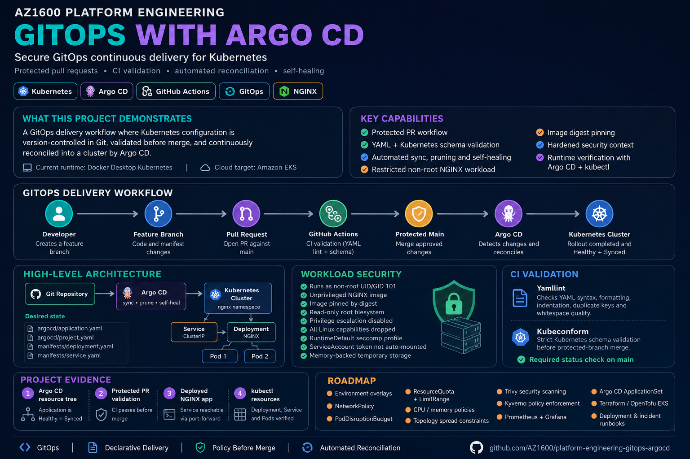
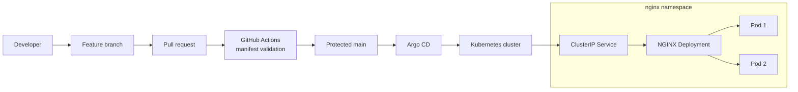
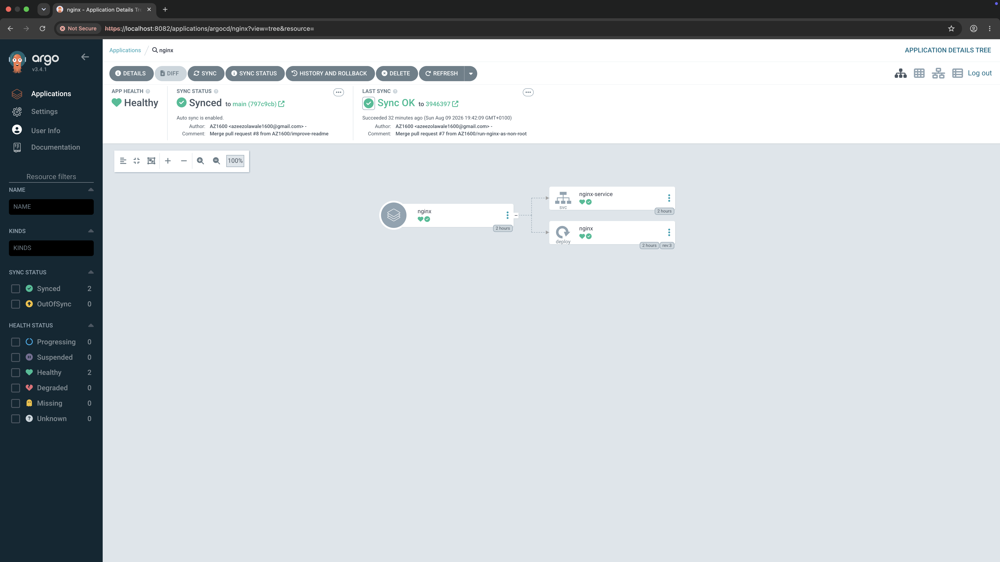
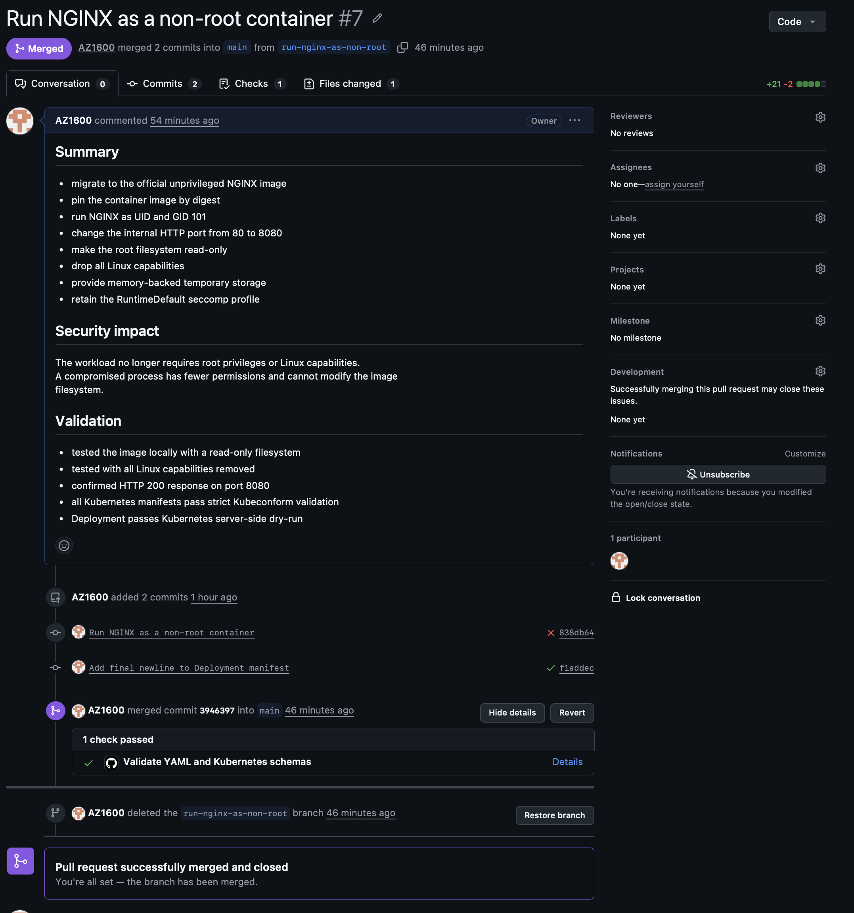
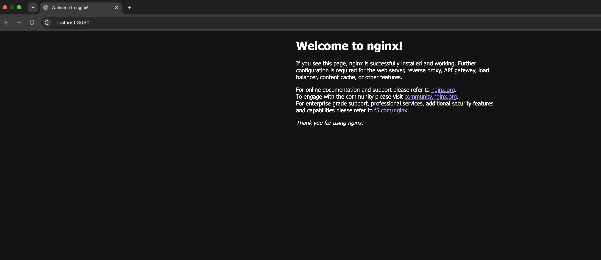
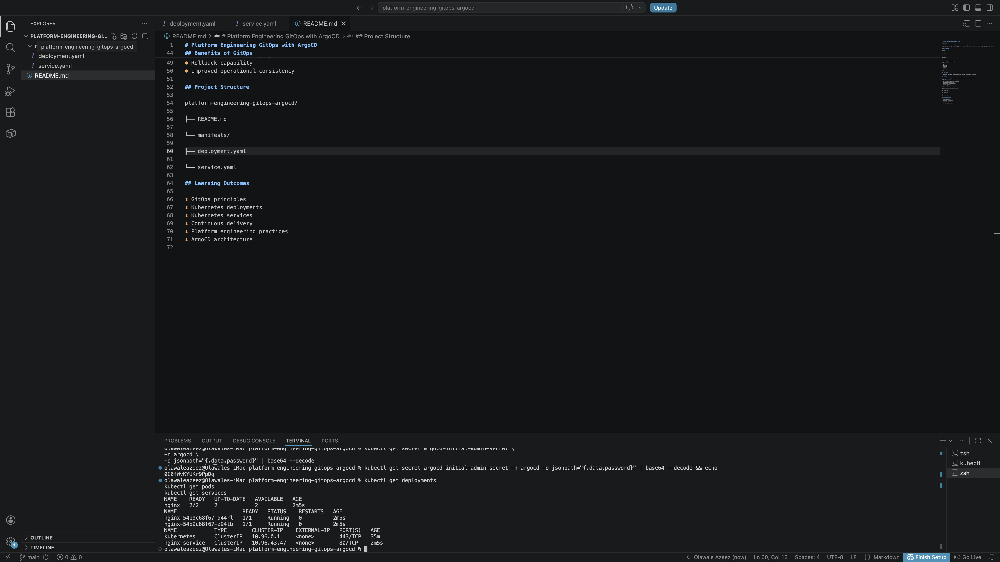

# Platform Engineering GitOps with Argo CD

A secure GitOps continuous-delivery project demonstrating how Kubernetes changes move from a developer branch through validation, protected pull requests, Argo CD reconciliation, and into a hardened Kubernetes workload.

[](https://github.com/AZ1600/platform-engineering-gitops-argocd/actions/workflows/validate-manifests.yaml)

---

## Overview

This project demonstrates a secure GitOps continuous-delivery workflow using **Argo CD, Kubernetes and GitHub Actions**.

Kubernetes resources are defined declaratively in Git.

Changes follow a controlled delivery path:

```text
Developer
    ↓
Feature Branch
    ↓
Pull Request
    ↓
CI Validation
    ↓
Protected Main Branch
    ↓
Argo CD
    ↓
Automated Reconciliation
    ↓
Kubernetes
    ↓
Healthy + Synced
```

GitHub Actions validates configuration before merge, while Argo CD continuously compares the desired state stored in Git with the Kubernetes cluster and reconciles differences automatically.

The project is currently demonstrated using a local **Docker Desktop Kubernetes cluster**.

The same GitOps model can later be adapted for managed Kubernetes environments such as **Amazon EKS**.

---

## Project Overview



The project combines Git-based change control, CI validation, Argo CD reconciliation, Kubernetes workload security and runtime verification.

The design demonstrates the separation between:

```text
Change authoring
      ↓
Configuration validation
      ↓
Merge approval
      ↓
Desired state
      ↓
Automated reconciliation
      ↓
Runtime verification
```

Git remains the source of truth while Argo CD is responsible for continuously driving the Kubernetes cluster toward that declared state.

---

## Architecture



### Architecture Responsibilities

**GitHub**

Stores the declarative desired state and provides pull-request-based change control.

**GitHub Actions**

Validates YAML quality and Kubernetes schemas before configuration is merged.

**Protected `main`**

Represents the approved desired state of the environment.

**Argo CD**

Continuously monitors Git and reconciles the Kubernetes cluster when the desired state changes.

**Kubernetes**

Runs the application workload and reports deployment and health status.

---

## GitOps Workflow

A typical change follows this lifecycle:

1. A developer creates a feature branch.
2. Kubernetes or Argo CD configuration is changed.
3. A pull request is opened against `main`.
4. GitHub Actions validates YAML quality and Kubernetes schemas.
5. The protected branch allows the change to be merged after the required check passes.
6. Argo CD detects the new commit on `main`.
7. Argo CD compares the desired state in Git with the live Kubernetes state.
8. Argo CD synchronizes any required changes.
9. Kubernetes performs the rollout.
10. Argo CD reports the application as `Healthy` and `Synced`.

This demonstrates a core GitOps principle:

> Infrastructure changes are introduced through Git rather than through unmanaged manual changes to the cluster.

---

## Technologies

- Kubernetes
- Argo CD
- Docker Desktop
- GitHub
- GitHub Actions
- GitHub branch protection
- NGINX
- Yamllint
- Kubeconform
- GitOps

---

## Repository Structure

```text
platform-engineering-gitops-argocd/
├── .github/
│   └── workflows/
│       └── validate-manifests.yaml
│
├── argocd/
│   ├── application.yaml
│   └── project.yaml
│
├── docs/
│   └── screenshots/
│       ├── gitops-argocd-overview.png
│       ├── argocd-resource-tree.png
│       ├── kubectl-resources.png
│       ├── nginx-application.png
│       └── protected-pr-validation.png
│
├── manifests/
│   ├── deployment.yaml
│   └── service.yaml
│
└── README.md
```

---

# Components

## Argo CD Application

`argocd/application.yaml` defines the application managed by Argo CD.

The Application configures:

- Git repository source
- `main` as the tracked revision
- `manifests/` as the deployment path
- Target Kubernetes cluster
- Target `nginx` namespace
- Automated synchronization
- Automatic pruning
- Self-healing
- Namespace creation
- Retry and exponential backoff behaviour

The automated policy allows Argo CD to restore the live cluster when it drifts from the desired state in Git.

---

## Argo CD Project

`argocd/project.yaml` defines an Argo CD `AppProject`.

Rather than allowing unrestricted deployment privileges, the project limits:

- The approved Git repository
- The allowed Kubernetes destination
- The permitted namespace
- The permitted resource types

This provides a stronger security boundary around what the GitOps application can deploy.

---

## Kubernetes Deployment

`manifests/deployment.yaml` defines the NGINX workload.

The Deployment contains two replicas and uses a rolling-update strategy.

It also defines:

- Readiness probes
- Liveness probes
- CPU requests
- CPU limits
- Memory requests
- Memory limits
- ReplicaSet revision history
- Minimum ready time
- Deployment progress timeout

The deployment strategy uses:

```text
maxUnavailable: 0
maxSurge: 1
```

allowing Kubernetes to introduce a replacement Pod before removing an existing ready replica.

---

## Kubernetes Service

`manifests/service.yaml` provides stable internal access to the NGINX Pods.

The Service:

- Selects Pods using the `app: nginx` label
- Exposes port `80`
- Routes traffic to the named container HTTP port
- Uses `ClusterIP`

The workload itself listens on port `8080` using the unprivileged NGINX image.

---

# Workload Security

The NGINX workload was intentionally hardened rather than running with default container privileges.

The container:

- Runs as non-root UID `101`
- Runs as non-root GID `101`
- Uses the official unprivileged NGINX image
- Uses an image pinned by digest
- Uses a read-only root filesystem
- Prevents privilege escalation
- Drops all Linux capabilities
- Uses the `RuntimeDefault` seccomp profile
- Does not automatically mount a Kubernetes ServiceAccount token
- Uses memory-backed temporary storage

These controls reduce the permissions available to the workload if the container is compromised.

---

## Container Security Model

```text
NGINX Container
      │
      ├── runAsNonRoot
      ├── UID / GID 101
      ├── readOnlyRootFilesystem
      ├── allowPrivilegeEscalation: false
      ├── capabilities: DROP ALL
      ├── RuntimeDefault seccomp
      ├── no automatic API token
      └── digest-pinned image
```

Security is applied as part of the declarative Kubernetes configuration rather than being treated as a separate manual step.

---

# Software Supply Chain Controls

The project also applies controls before Kubernetes configuration reaches the cluster.

These include:

- Pull-request-based changes
- Protected `main` branch
- Required CI validation
- Minimal GitHub Actions permissions
- Pinned GitHub Actions dependencies
- Pinned validation container image
- YAML linting
- Kubernetes schema validation
- Container image digest pinning

This creates two layers of protection:

```text
Before Merge
    ↓
CI + Pull Request Controls
    ↓
Approved Desired State
    ↓
Argo CD Reconciliation
    ↓
Hardened Runtime Workload
```

---

# Continuous Integration

GitHub Actions validates repository changes before they are merged.

## YAML Linting

Yamllint validates:

- YAML syntax
- Formatting
- Indentation
- Duplicate keys
- Trailing whitespace
- Missing final newlines
- Common YAML quality problems

The workflow checks:

```text
manifests/
argocd/
.github/workflows/
```

---

## Kubernetes Schema Validation

Kubeconform performs strict schema validation against the standard Kubernetes resources in:

```text
manifests/
```

The workflow includes:

- Strict schema validation
- Validation summary output
- Minimal `contents: read` permissions
- Pinned dependencies
- Job timeout
- Concurrency cancellation

Passing CI confirms that the Kubernetes manifests satisfy the configured structural validation rules.

Runtime behaviour is verified separately inside the Kubernetes cluster.

---

# Local Environment

## Prerequisites

Install:

- Docker Desktop with Kubernetes enabled
- `kubectl`
- Git
- Argo CD CLI, optional but recommended

Confirm access:

```bash
kubectl config current-context
kubectl cluster-info
```

For this project, the expected local context is:

```text
docker-desktop
```

---

# Install Argo CD Locally

Create the namespace:

```bash
kubectl create namespace argocd
```

Install Argo CD:

```bash
kubectl apply \
  --namespace argocd \
  --filename https://raw.githubusercontent.com/argoproj/argo-cd/stable/manifests/install.yaml
```

Wait for the Argo CD deployments:

```bash
kubectl wait \
  --namespace argocd \
  --for=condition=Available \
  deployment \
  --all \
  --timeout=300s
```

Confirm the Pods:

```bash
kubectl get pods --namespace argocd
```

---

# Open the Argo CD Interface

Forward a local port:

```bash
kubectl port-forward \
  --namespace argocd \
  service/argocd-server \
  8082:443
```

Open:

```text
https://localhost:8082
```

The browser may display a certificate warning because the local Argo CD server uses a self-signed certificate.

Retrieve the initial administrator password:

```bash
kubectl get secret argocd-initial-admin-secret \
  --namespace argocd \
  --output jsonpath='{.data.password}' |
  base64 --decode

echo
```

Sign in with:

```text
username: admin
```

---

# Bootstrap the GitOps Application

Apply the Argo CD project first:

```bash
kubectl apply --filename argocd/project.yaml
```

Then apply the Application:

```bash
kubectl apply --filename argocd/application.yaml
```

Argo CD will create the `nginx` namespace and synchronize the manifests automatically.

---

# Verify the Deployment

Check the Argo CD Application:

```bash
kubectl get application nginx --namespace argocd
```

Expected status:

```text
NAME    SYNC STATUS   HEALTH STATUS
nginx   Synced        Healthy
```

Check Kubernetes resources:

```bash
kubectl get all --namespace nginx
```

Verify the rollout:

```bash
kubectl rollout status \
  deployment/nginx \
  --namespace nginx
```

Check the Pods:

```bash
kubectl get pods --namespace nginx
```

---

# Verify Workload Security

## Verify Non-Root Execution

Select a Pod:

```bash
POD_NAME=$(kubectl get pods \
  --namespace nginx \
  --selector app=nginx \
  --output jsonpath='{.items[0].metadata.name}')
```

Check the user inside the container:

```bash
kubectl exec \
  --namespace nginx \
  "$POD_NAME" \
  -- id
```

Expected output should show UID and GID `101`.

---

## Verify ServiceAccount Token Protection

Check the Deployment configuration:

```bash
kubectl get deployment nginx \
  --namespace nginx \
  --output jsonpath='{.spec.template.spec.automountServiceAccountToken}{"\n"}'
```

Expected:

```text
false
```

The application does not require Kubernetes API access, so automatically exposing a ServiceAccount credential is unnecessary.

---

# Access the Application

Forward the Service locally:

```bash
kubectl port-forward \
  --namespace nginx \
  service/nginx-service \
  8080:80
```

Open:

```text
http://localhost:8080
```

Keep the terminal process running while accessing the application.

If port `8080` is already in use:

```bash
kubectl port-forward \
  --namespace nginx \
  service/nginx-service \
  8081:80
```

Then open:

```text
http://localhost:8081
```

---

# Project Evidence

The screenshots below provide evidence of the complete GitOps workflow rather than showing configuration files alone.

---

## Argo CD Resource Tree



The Argo CD resource tree shows the deployed application and its Kubernetes resources.

The application is reported as:

```text
Synced
Healthy
```

This confirms that the live Kubernetes environment matches the desired state stored in Git.

The resource tree also provides visibility into the Deployment, Service and running Pods managed through the GitOps workflow.

---

## Protected Pull Request Validation



Changes are introduced through pull requests rather than applied directly to the protected `main` branch.

The validation workflow checks YAML quality and Kubernetes manifest schemas before the change is allowed to become the approved desired state.

This example also documents the migration of NGINX to a hardened non-root workload using:

- Read-only filesystem
- Dropped Linux capabilities
- Unprivileged container image
- Digest pinning
- RuntimeDefault seccomp
- Disabled automatic ServiceAccount token mounting

The pull request provides an auditable record of both the engineering change and its validation.

---

## Deployed NGINX Application



The NGINX workload is accessible through the Kubernetes Service using local port forwarding.

This screenshot demonstrates that the Git-managed Kubernetes configuration produced a functioning application rather than only passing static validation.

---

## Kubernetes Resources



The deployed resources can also be verified independently using `kubectl`.

This provides runtime evidence for:

- Deployment
- Service
- Pods
- Pod readiness
- Replica availability
- Namespace state

Using both Argo CD and `kubectl` provides visibility from the GitOps control plane and the Kubernetes runtime.

---

# Troubleshooting

## Argo CD Namespace Not Found

Check:

```bash
kubectl get namespace argocd
kubectl get pods --namespace argocd
```

If the namespace does not exist, install Argo CD before applying the `Application` and `AppProject` resources.

---

## Application Remains OutOfSync

Request a hard refresh:

```bash
kubectl annotate application nginx \
  --namespace argocd \
  argocd.argoproj.io/refresh=hard \
  --overwrite
```

Check again:

```bash
kubectl get application nginx --namespace argocd
```

---

## Application Reports Missing

Inspect the Application:

```bash
kubectl get application nginx \
  --namespace argocd \
  --output yaml
```

Verify:

- Repository URL
- Target revision
- Manifest path
- Destination cluster
- Destination namespace

---

## Local Port Already in Use

Stop the previous process with:

```text
Ctrl+C
```

or choose another port:

```bash
kubectl port-forward \
  --namespace nginx \
  service/nginx-service \
  8081:80
```

---

## Validation Workflow Fails

Run Yamllint locally:

```bash
yamllint manifests argocd .github/workflows
```

Run Kubeconform:

```bash
docker run --rm \
  --volume "${PWD}:/work" \
  ghcr.io/yannh/kubeconform:v0.7.0@sha256:85dbef6b4b312b99133decc9c6fc9495e9fc5f92293d4ff3b7e1b30f5611823c \
  -strict \
  -summary \
  /work/manifests
```

---

# Engineering Principles

## Git Is the Source of Truth

The approved configuration stored in Git represents the desired state.

---

## Changes Go Through Review

Infrastructure configuration should follow the same review practices as application code.

---

## Validate Before Reconcile

Configuration is checked before reaching the protected branch and subsequently being consumed by Argo CD.

---

## Minimize Runtime Privileges

The application workload receives only the permissions required to run.

---

## Reconciliation Over Manual Repair

Argo CD continuously detects drift and drives the environment back toward the declared desired state.

---

## Runtime Verification Matters

Passing CI verifies configuration structure.

It does not prove that the workload functions correctly.

Runtime verification is therefore performed separately using Kubernetes and Argo CD.

---

# Learning Outcomes

This project demonstrates:

- GitOps continuous delivery
- Declarative Kubernetes configuration
- Argo CD Applications
- Argo CD Projects
- Automated synchronization
- Automatic pruning
- Self-healing
- Protected pull-request workflows
- Kubernetes schema validation in CI
- YAML quality validation
- Secure non-root container execution
- Container image digest pinning
- Read-only container filesystems
- Kubernetes workload security controls
- Health probes
- CPU and memory requests and limits
- Rolling deployment strategies
- Operational verification
- Troubleshooting
- Technical documentation with runtime evidence

---

# Future Improvements

Planned improvements include:

- Add Kustomize base and environment overlays
- Add development, staging and production environments
- Add namespace `ResourceQuota` and `LimitRange` policies
- Add a Kubernetes `NetworkPolicy`
- Add a `PodDisruptionBudget`
- Add topology-spread constraints
- Add Trivy container and configuration scanning
- Add Dependabot or Renovate
- Add Kyverno or Gatekeeper policy enforcement
- Add Prometheus metrics
- Add Grafana dashboards
- Add operational alerts
- Add deployment and incident runbooks
- Add Argo CD `ApplicationSet`
- Validate Argo CD custom resources in CI
- Provision Amazon EKS using Terraform or OpenTofu

---

# Project Status

The current project demonstrates a working local GitOps lifecycle:

```text
Feature Branch
      ↓
Pull Request
      ↓
CI Validation
      ↓
Protected Main
      ↓
Argo CD
      ↓
Kubernetes
      ↓
Healthy + Synced
```

The application has been tested using Docker Desktop Kubernetes.

Cloud deployment to Amazon EKS remains a future extension rather than a current production deployment.

---

# Author

**Olawale Azeez**

Cloud Engineer | Platform Engineer | DevOps Engineer

Focused on Kubernetes, GitOps, Platform Engineering, AWS, Infrastructure as Code, CI/CD, observability and cloud-native engineering.

GitHub: https://github.com/AZ1600