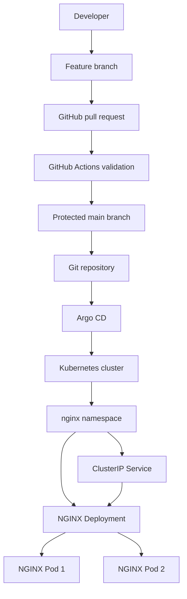
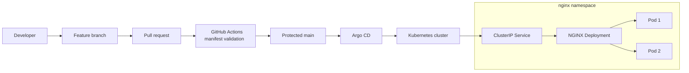

# Platform Engineering GitOps with Argo CD

[](https://github.com/AZ1600/platform-engineering-gitops-argocd/actions/workflows/validate-manifests.yaml)

## Overview

This project demonstrates a secure GitOps continuous-delivery workflow using Argo CD, Kubernetes and GitHub Actions.

Kubernetes resources are defined declaratively in Git. Changes are introduced through protected pull requests, validated in CI and merged into the `main` branch. Argo CD continuously compares the repository with the Kubernetes cluster and automatically reconciles differences.

The project is currently demonstrated on a local Docker Desktop Kubernetes cluster. The manifests and GitOps design can also be adapted for managed Kubernetes platforms such as Amazon EKS.

## Architecture



## GitOps Workflow

1. A developer creates a feature branch.
2. Kubernetes or Argo CD configuration is changed.
3. A pull request is opened against `main`.
4. GitHub Actions checks YAML quality and Kubernetes schemas.
5. The protected branch permits the change to be merged after the required check passes.
6. Argo CD detects the new Git revision.
7. Argo CD synchronizes the desired state into Kubernetes.
8. Kubernetes performs the rollout and reports resource health.
9. Argo CD reports the application as `Healthy` and `Synced`.

## Technologies

- Kubernetes
- Argo CD
- Docker Desktop
- GitHub Actions
- GitHub branch protection
- NGINX
- Yamllint
- Kubeconform
- GitOps

## Repository Structure

```text


## Components

### Argo CD Application

`argocd/application.yaml` defines the application watched by Argo CD.

It includes:

- Automated synchronization
- Automatic pruning
- Self-healing
- Namespace creation
- Retry behaviour
- Deployment from the `main` branch
- Kubernetes manifests loaded from `manifests/`

### Argo CD Project

`argocd/project.yaml` limits the application's permitted source repository, deployment destination and Kubernetes resource types.

### Kubernetes Deployment

`manifests/deployment.yaml` manages the NGINX replicas and applies workload security controls.

The container:

- Runs as non-root UID and GID `101`
- Uses the unprivileged NGINX image
- Uses an image pinned by digest
- Uses a read-only root filesystem
- Prevents privilege escalation
- Drops all Linux capabilities
- Uses the `RuntimeDefault` seccomp profile
- Does not automatically mount a service-account token
- Uses memory-backed temporary storage
- Exposes container port `8080`

### Kubernetes Service

`manifests/service.yaml` provides stable internal access to the NGINX Pods and forwards traffic to the named HTTP container port.

## Continuous Integration

The GitHub Actions workflow validates repository changes before they are merged.

### YAML linting

Yamllint checks:

- YAML formatting and indentation
- Duplicate keys
- Trailing whitespace
- Missing final newlines
- Common YAML quality problems

### Kubernetes schema validation

Kubeconform performs strict schema validation of the standard Kubernetes manifests in `manifests/`.

The workflow uses:

- Minimal read-only GitHub permissions
- Pinned action and container dependencies
- A job timeout
- Concurrency cancellation
- A required status check on the protected `main` branch

Passing CI confirms that the files meet the configured YAML and Kubernetes schema rules. Runtime behaviour is verified separately in the Kubernetes cluster.

## Prerequisites

Install:

- Docker Desktop with Kubernetes enabled
- `kubectl`
- Git
- Argo CD CLI (optional but recommended)

Confirm cluster access:

```bash
kubectl config current-context
kubectl cluster-info
```

## Install Argo CD Locally

Create the Argo CD namespace:

```bash
kubectl create namespace argocd
```

Install Argo CD:

```bash
kubectl apply \
  --namespace argocd \
  --filename https://raw.githubusercontent.com/argoproj/argo-cd/stable/manifests/install.yaml
```

Wait for the workloads:

```bash
kubectl wait \
  --namespace argocd \
  --for=condition=Available \
  deployment \
  --all \
  --timeout=300s
```

## Bootstrap the GitOps Application

Apply the project first:

```bash
kubectl apply --filename argocd/project.yaml
```

Then apply the application:

```bash
kubectl apply --filename argocd/application.yaml
```

Argo CD will create the `nginx` namespace and synchronize the manifests automatically.

## Verify the Deployment

Check the Argo CD application:

```bash
kubectl get application nginx --namespace argocd
```

Expected status:

```text
NAME    SYNC STATUS   HEALTH STATUS
nginx   Synced        Healthy
```

Check the Kubernetes resources:

```bash
kubectl get all --namespace nginx
```

Verify the rollout:

```bash
kubectl rollout status deployment/nginx --namespace nginx
```

Verify that the container runs as a non-root user:

```bash
POD_NAME=$(kubectl get pods \
  --namespace nginx \
  --selector app=nginx \
  --output jsonpath='{.items[0].metadata.name}')

kubectl exec --namespace nginx "$POD_NAME" -- id
```

The output should show UID and GID `101`.

## Access the Application

Forward a local port to the Kubernetes Service:

```bash
kubectl port-forward \
  --namespace nginx \
  service/nginx-service \
  8080:80
```

Open:

```text
http://localhost:8080
```

## Project Evidence

### Argo CD Resource Tree

Argo CD continuously reconciles the Git repository with the Kubernetes cluster. The application is synchronized and healthy, and its Deployment and Service match the desired state in Git.


### Protected Pull Request Validation

Changes are merged through pull requests after the required YAML and Kubernetes schema validation succeeds. This example also documents the migration of NGINX to a restricted, non-root container.


### Deployed NGINX Application

The application is accessible through the Kubernetes Service using local port forwarding.


### Kubernetes Resources

The Deployment, Service and Pods can also be inspected directly using `kubectl`.


## Troubleshooting

### Argo CD namespace not found

Verify that Argo CD is installed:

```bash
kubectl get namespace argocd
kubectl get pods --namespace argocd
```

### Application remains OutOfSync

Request a hard refresh:

```bash
kubectl annotate application nginx \
  --namespace argocd \
  argocd.argoproj.io/refresh=hard \
  --overwrite
```

Then check its status:

```bash
kubectl get application nginx --namespace argocd
```

### Local port is already in use

Use a different local port:

```bash
kubectl port-forward \
  --namespace nginx \
  service/nginx-service \
  8081:80
```

Then open `http://localhost:8081`.

## Learning Outcomes

This project demonstrates:

- GitOps continuous delivery
- Declarative Kubernetes configuration
- Argo CD projects and applications
- Automated reconciliation and self-healing
- Protected pull-request workflows
- Kubernetes schema validation in CI
- Secure non-root container execution
- Image digest pinning
- Kubernetes workload security controls
- Operational verification and troubleshooting

## Future Improvements

- Add Customize overlays for development, staging and production
- Add a Kubernetes `NetworkPolicy`
- Add a `PodDisruptionBudget`
- Add CPU and memory resource policies
- Add Prometheus metrics, dashboards and alerts
- Add automated dependency updates
- Provision a cloud Kubernetes environment with Terraform or OpenTofu
- Add deployment and incident runbooks
