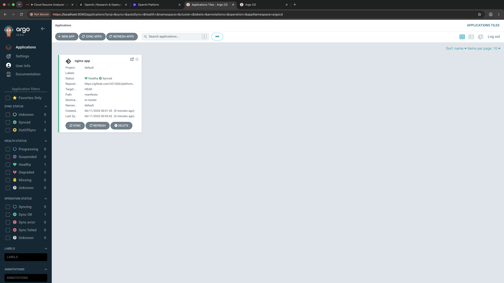

# Platform Engineering GitOps with Argo CD

[](https://github.com/AZ1600/platform-engineering-gitops-argocd/actions/workflows/validate-manifests.yaml)

## Overview

This project demonstrates GitOps-based continuous delivery using Argo CD and Kubernetes.

Kubernetes manifests are stored in GitHub as the desired state. Argo CD monitors the `main` branch, compares the manifests with the live cluster, and automatically reconciles differences.

The project can be tested locally with Docker Desktop Kubernetes. The same GitOps structure can also target Amazon EKS after updating the cluster destination and bootstrap process.

## Architecture

```text
Developer
    |
    v
Feature branch
    |
    v
Pull request
    |
    v
GitHub Actions validation
    |
    v
Protected main branch
    |
    v
Argo CD
    |
    v
Kubernetes cluster
    |
    v
NGINX Deployment and Service
```

## GitOps workflow

1. Create a feature branch.
2. Modify the Kubernetes or Argo CD configuration.
3. Open a pull request.
4. GitHub Actions validates YAML and Kubernetes schemas.
5. Merge only after the required check passes.
6. Argo CD detects the new `main` revision.
7. Argo CD synchronizes the cluster with Git.
8. Kubernetes performs a rolling update when the pod template changes.

Direct changes to `main` are restricted by a GitHub ruleset.

## Technologies

- Argo CD
- Kubernetes
- Docker Desktop Kubernetes
- Amazon EKS compatible
- GitHub
- GitHub Actions
- Docker
- Kubeconform
- Yamllint

## Repository structure

```text
platform-engineering-gitops-argocd/
├── .github/
│   └── workflows/
│       └── validate-manifests.yaml
├── argocd/
│   ├── application.yaml
│   └── project.yaml
├── docs/
│   └── screenshots/
│       ├── argocd-healthy-synced.png
│       └── kubectl-resources.png
├── manifests/
│   ├── deployment.yaml
│   └── service.yaml
└── README.md
```

## Components

### Argo CD AppProject

`argocd/project.yaml` defines the security boundary for the application.

It restricts:

- Which Git repository Argo CD may use
- Which cluster and namespace it may deploy to
- Which Kubernetes resource kinds it may create

### Argo CD Application

`argocd/application.yaml` tells Argo CD to:

- Monitor the `main` branch
- Read manifests from `manifests/`
- Deploy into the `nginx` namespace
- Prune resources removed from Git
- Reverse manual configuration drift
- Retry temporary synchronization failures

### NGINX Deployment

`manifests/deployment.yaml` defines a two-replica NGINX workload with:

- Rolling updates
- Readiness and liveness probes
- CPU and memory requests and limits
- RuntimeDefault seccomp profile
- Automatic ServiceAccount-token mounting disabled
- Non-root UID and GID
- Read-only root filesystem
- All Linux capabilities removed
- Memory-backed temporary storage
- Container image pinned by digest

### NGINX Service

`manifests/service.yaml` provides internal access to the NGINX pods through a ClusterIP Service.

The Service exposes port `80` and forwards traffic to the container's named `http` port on `8080`.

## Prerequisites

Install and configure:

- Docker Desktop with Kubernetes enabled, or access to a Kubernetes cluster
- `kubectl`
- `git`
- Docker
- A GitHub account

Confirm the active Kubernetes context before making changes:

```bash
kubectl config current-context
kubectl cluster-info
```

For local testing, the expected context is:

```text
docker-desktop
```

## Install Argo CD locally

Create the Argo CD namespace:

```bash
kubectl create namespace argocd
```

Install the pinned Argo CD release:

```bash
kubectl apply \
  --namespace argocd \
  --server-side \
  --force-conflicts \
  --filename https://raw.githubusercontent.com/argoproj/argo-cd/v3.4.1/manifests/install.yaml
```

Wait for all Argo CD pods:

```bash
kubectl wait \
  --namespace argocd \
  --for=condition=Ready \
  pod \
  --all \
  --timeout=300s
```

Verify:

```bash
kubectl get pods --namespace argocd
```

## Bootstrap the GitOps application

Apply the AppProject first:

```bash
kubectl apply --filename argocd/project.yaml
```

Then create the Application:

```bash
kubectl apply --filename argocd/application.yaml
```

Watch synchronization:

```bash
kubectl get application nginx \
  --namespace argocd \
  --watch
```

The desired state is:

```text
NAME    SYNC STATUS   HEALTH STATUS
nginx   Synced        Healthy
```

## Verify the workload

```bash
kubectl get deployment,service,pods --namespace nginx
kubectl rollout status deployment/nginx --namespace nginx
```

Verify that ServiceAccount tokens are not mounted automatically:

```bash
kubectl get deployment nginx \
  --namespace nginx \
  --output jsonpath='{.spec.template.spec.automountServiceAccountToken}{"\n"}'
```

Expected:

```text
false
```

Verify the container's runtime identity:

```bash
POD_NAME=$(kubectl get pods \
  --namespace nginx \
  --selector app=nginx \
  --output jsonpath='{.items[0].metadata.name}')

kubectl exec \
  --namespace nginx \
  "${POD_NAME}" \
  -- id
```

The process should use non-root UID and GID `101`.

## Access NGINX locally

Start port forwarding:

```bash
kubectl port-forward \
  --namespace nginx \
  service/nginx-service \
  8080:80
```

In another terminal:

```bash
curl --fail http://localhost:8080
```

Press `Ctrl+C` to stop port forwarding.

## Continuous integration

GitHub Actions validates relevant repository changes with:

- Yamllint for YAML formatting
- Kubeconform for strict Kubernetes schema validation
- Read-only workflow permissions
- Pinned action and container dependencies
- Concurrent-run cancellation

Run Kubeconform locally:

```bash
docker run --rm \
  --volume "${PWD}:/work" \
  ghcr.io/yannh/kubeconform:v0.7.0@sha256:85dbef6b4b312b99133decc9c6fc9495e9fc5f92293d4ff3b7e1b30f5611823c \
  -strict \
  -summary \
  /work/manifests
```

## Troubleshooting

### Application remains OutOfSync

Force Argo CD to refresh its Git information:

```bash
kubectl annotate application nginx \
  --namespace argocd \
  argocd.argoproj.io/refresh=hard \
  --overwrite
```

Inspect the Application:

```bash
kubectl describe application nginx --namespace argocd
```

### Pods do not become ready

```bash
kubectl get pods --namespace nginx
kubectl describe deployment nginx --namespace nginx
kubectl logs --namespace nginx deployment/nginx
```

### Compare Git and Argo CD revisions

```bash
git fetch origin
git rev-parse origin/main

kubectl get application nginx \
  --namespace argocd \
  --output jsonpath='{.status.sync.revision}{"\n"}'
```

## Screenshots

### Argo CD Application



### Kubernetes resources


## Learning outcomes

This project demonstrates:

- GitOps principles
- Declarative Argo CD configuration
- Pull-request-based delivery
- Automated manifest validation
- Protected deployment branches
- Kubernetes rolling updates
- Configuration-drift correction
- Least-privilege container security
- Reproducible local Kubernetes testing

## Future improvements

- Add Kustomize base and environment overlays
- Add NetworkPolicy and PodDisruptionBudget
- Validate Argo CD custom resources in CI
- Add dependency update automation
- Add monitoring, alerts, and operational runbooks
- Provision EKS and Argo CD through infrastructure as code